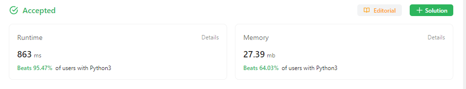

### 1. Two Sum

##### Question

[Two Sum - LeetCode](https://leetcode.com/problems/two-sum/)

Given an array of integers `nums` and an integer `target`, return *indices of the two numbers such that they add up to `target`*.

You may assume that each input would have ***exactly* one solution**, and you may not use the *same* element twice.

You can return the answer in any order.


##### Solution

 经典，因为在map搜索key是O(1)，在历遍途中用target减当前element得出complement，在map里搜索complement，有就return，没有就把当前element当成可以key放进map里，value是index。


##### Code

```
class Solution:
    def twoSum(self, nums: List[int], target: int) -> List[int]:
        newmap =  {}

        for i in range(len(nums)):
            complement = target - nums[i]
            if complement in newmap:
                return [newmap[complement], i]
            newmap[nums[i]] = i
        
        return []
```


##### Result


