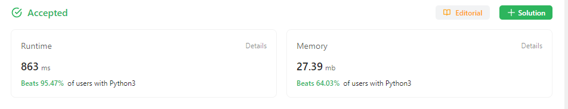

### 121. Best Time to Buy and Sell Stock

##### Question

[Best Time to Buy and Sell Stock - LeetCode](https://leetcode.com/problems/best-time-to-buy-and-sell-stock/description/)

You are given an array `prices` where `prices[i]` is the price of a given stock on the `ith` day.

You want to maximize your profit by choosing a **single day** to buy one stock and choosing a **different day in the future** to sell that stock.

Return *the maximum profit you can achieve from this transaction*. If you cannot achieve any profit, return `0`.


##### Solution

简单，首先设定一个初始购买日`start`和目前最大收益`currentMax`, 历遍array，如果当天的股价小于`start`那天的股价，将`start`更新为当天的股价。如果当天的股价大于`start`那天的股价，那么用当天的股价减去`start`那天的股价的并与`currentMax`比较，取高的更新`currentMax`。


##### Code

```
class Solution:
    def maxProfit(self, prices: List[int]) -> int:
        currentMax = 0
        start = 0

        for i in range(1, len(prices)):
            if prices[i] > prices[start]:
                currentMax = max(currentMax, prices[i] - prices[start])
            else:
                start = i
        
        return currentMax
```


##### Result



