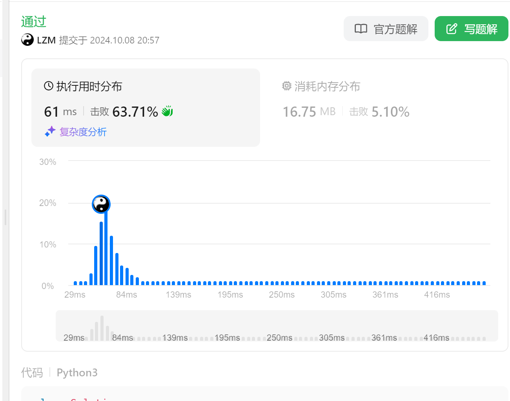

### 3. Longest Substring Without Repeating Characters

##### Question

https://leetcode.cn/problems/longest-substring-without-repeating-characters/description/

Given a string `s`, find the length of the **longest** **substring**  without repeating characters.


##### Solution

sliding window


##### Code

```python
class Solution:
    def lengthOfLongestSubstring(self, s: str) -> int:
        store = dict()
        res = 0
        currMax = 0
        start = 0
        for i in range(len(s)):
            if s[i] in store and store[s[i]] >= start:
                
                res = max(currMax, res)
                start = store[s[i]] + 1
                currMax = i - start + 1
                store[s[i]] = i
                print(currMax)
            else:
                currMax += 1
                store[s[i]] = i 
        return max(res, currMax)

```


##### Result

