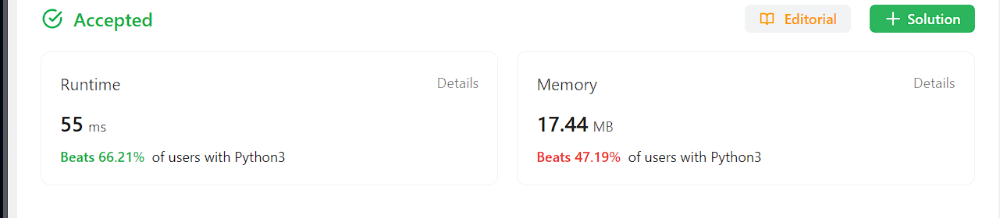

### 345. Reverse Vowels of a String

##### Question

[Reverse Vowels of a String - LeetCode](https://leetcode.com/problems/reverse-vowels-of-a-string/)

Given a string `s`, reverse only all the vowels in the string and return it.

The vowels are `'a'`, `'e'`, `'i'`, `'o'`, and `'u'`, and they can appear in both lower and upper cases, more than once.


##### Solution

Two pointers 解决这个问题，左右一边是vowel的时候就这一边停止加减index，另外一边正常加减。双边都抵达vowel的时候，swap后继续加减index，直到meet。因为search in dict是O(1)，牺牲一些space无所谓。


##### Code

```python
class Solution:
    def reverseVowels(self, s: str) -> str:
        listStr = list(s)
        store = dict()
        store["a"] = 1
        store["e"] = 1
        store["i"] = 1
        store["o"] = 1
        store["u"] = 1
        store["A"] = 1
        store["E"] = 1
        store["I"] = 1
        store["O"] = 1
        store["U"] = 1
        start = 0
        end = len(s) - 1
        while start < end:
            if listStr[start] not in store:
                start += 1
            if listStr[end] not in store:
                end -= 1
            if listStr[start] in store and listStr[end] in store:
                listStr[start], listStr[end] = listStr[end], listStr[start]
                start += 1
                end -= 1
        res = "".join(listStr)
        return res
```


##### Result

