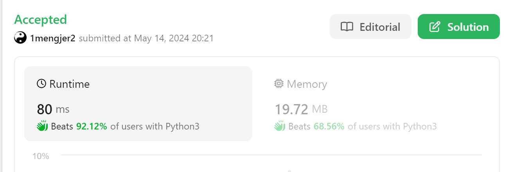

### 49. Group Anagrams

##### Question

https://leetcode.com/problems/group-anagrams/description/

Given an array of strings `strs`, group **the anagrams** together. You can return the answer in **any order**.

An **Anagram** is a word or phrase formed by rearranging the letters of a different word or phrase, typically using all the original letters exactly once.


##### Solution

大家sort完后的的key都是一样的，defaultdict(list)后append就行。


##### Code

```python
from collections import defaultdict
class Solution:
    def groupAnagrams(self, strs: List[str]) -> List[List[str]]:
        a = defaultdict(list)

        for i in strs:
            sort = ''.join(sorted(i))
            a[sort].append(i)
        
        return list(a.values())
```


##### Result

